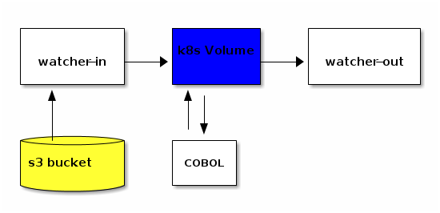

# COBOL on k8s

## Scope

This repository shows off a simple [ETL pipeline](https://databricks.com/glossary/etl-pipeline) using
COBOL and Kubernetes.

There are two main portions to this repository. The [docker-containers](./docker-containers) holds the
configuration and repeatable builds of the different containers of the ETL pipeline. The [k8s](./k8s)
directory has the `.yaml` files to deploy the said containers to a Kubernetes cluster on [IBM Cloud](https://cloud.ibm.com).

The demo COBOL applicaiton is located [here](./plus5numbers.cbl). It is a simple COBOL application
that takes in a file called `numbers.txt` (an [example](./numbers.txt.example) here) and outputs a
file called `newNumbers.txt` with every number rewritten 5 added to it. If you take a look at the
diagram below you see the pipeline illustrated.



## Demoing it Yourself

### Pre-Requisites

- An s3 bucket like Cloud Object Storage on IBM Cloud
- `s3fs` installed on the machine to upload a `numbers.txt`
- `docker` if you want to build the containers
- A Kubernetes cluster like the Kubernetes Service on IBM Cloud
- Edit the `local.env.example` and save it as `local.env` for the needed `exports`

### Object storage

Create a an object storage instance, for instance `asgharlabs-cobol`. Then created a bucket, for instance `asgharlabs-cobol-in` that you can put a file into it. Set it to `Public` access also, so you can download from it directly.

Steps make the bucket public: [example](https://s3.sjc04.cloud-object-storage.appdomain.cloud/asgharlabs-in/numbers.txt)

- Choose the bucket that you want to be publicly accessible. Keep in mind this policy makes all objects in a bucket available to download for anyone with the appropriate URL.
- Select Access policies from the navigation menu.
- Select the Public access tab.
- Click Create access policy. After you read the warning, choose Enable.
- Now all objects in this bucket are publicly accessible!

To create a Service account:
- Log in to the IBM Cloud console and navigate to your instance of Object Storage.
- In the side navigation, click Service Credentials.
- Click New credential and provide the necessary information. If you want to generate HMAC credentials, click 'Include HMAC Credential' check box
- Click Add to generate service credential.

Expanded the `View Credentials` and found the `access_key_id` and `secret_access_key` and put them
in a file with `access_key_id:secret_access_key` format.

Example of using `s3fs` to mount the local directory.

```bash
s3fs asgharlabs-in s3/ -o url=https://s3.sjc04.cloud-object-storage.appdomain.cloud -o passwd_file=key.key
```

### Steps to Run the Demo

Assuming you have built and deployed the containers to something like Docker Hub, you can to the following
steps to get just run the demo.

- Go into the `k8s/` directory on the local machine
- Run `01_setup.sh` to set up the kubernetes cluster, you should see something like the following:
```console
$ > ./01_setup.sh

persistentvolumeclaim/k8s-cobol created
.........................deployment.apps/workhorse created
deployment.apps/watcher-in created
deployment.apps/watcher-out created
deployment.apps/cobol-process created
```
- When that is done, you will have your pods on the Kubernetes cluster.
```console
$ > kubectl get pods
NAME                             READY   STATUS    RESTARTS   AGE
cobol-process-7f668fcb59-4lhtz   1/1     Running   0          79s
watcher-in-579779fd7d-ss74q      1/1     Running   0          80s
watcher-out-6fbfbd96f5-srtkv     1/1     Running   0          79s
workhorse-64ff8944b-5ff9c        1/1     Running   0          86s
```
- Open up 3 terminals and go to the `display/` directory, run one script in each, you should see
the outputs of each step in the pipeline.
- Copy a `numbers.txt` into the `s3/` directory, and in the `watcher-in` terminal you should see
the `wget` and file move.
- Look at the `cobol-process` terminal and you should see the output of the file and new file.
- Finally look at the `watcher-out` container and you should see the new file outputed.
- When you are done, run `99_cleanup.sh` and you should see something like:
```console
$ > ./99_cleanup.sh
deployment.extensions "cobol-process" deleted
deployment.extensions "watcher-in" deleted
deployment.extensions "watcher-out" deleted
deployment.extensions "workhorse" deleted
pod "cobol-process-7f668fcb59-4lhtz" deleted
pod "watcher-in-579779fd7d-ss74q" deleted
pod "watcher-out-6fbfbd96f5-srtkv" deleted
pod "workhorse-64ff8944b-5ff9c" deleted
service "kubernetes" deleted
persistentvolumeclaim "k8s-cobol" deleted
```

## License & Authors

If you would like to see the detailed LICENCE click [here](./LICENCE).

- Author: JJ Asghar <awesome@ibm.com>

```text
Copyright:: 2019- IBM, Inc

Licensed under the Apache License, Version 2.0 (the "License");
you may not use this file except in compliance with the License.
You may obtain a copy of the License at

http://www.apache.org/licenses/LICENSE-2.0

Unless required by applicable law or agreed to in writing, software
distributed under the License is distributed on an "AS IS" BASIS,
WITHOUT WARRANTIES OR CONDITIONS OF ANY KIND, either express or implied.
See the License for the specific language governing permissions and
limitations under the License.
```
